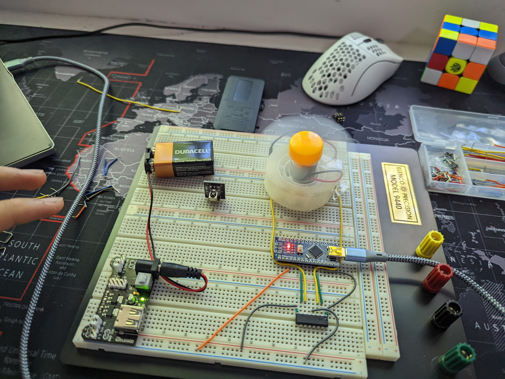

Fan Controlled by IR Remote, with adjustable fan speed, direction, start, and stop capabilities. Built using Arduino Nano, IR remote control sensor, power supply module, and motor. 

video demonstration (please excuse the background music) https://photos.app.goo.gl/habvE9Gmy2v5v6Ao6 

 
